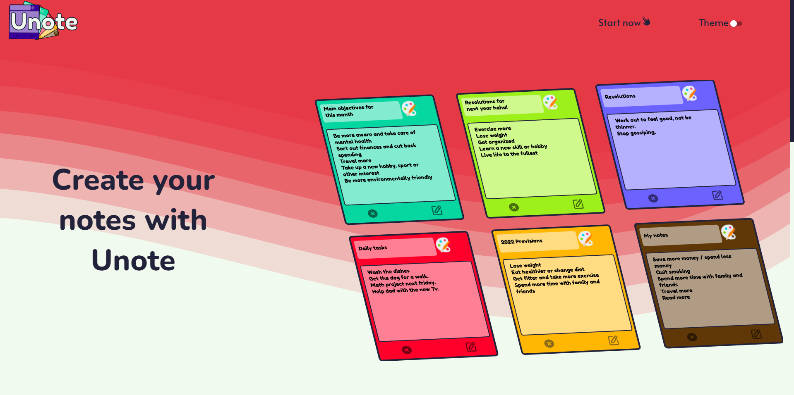
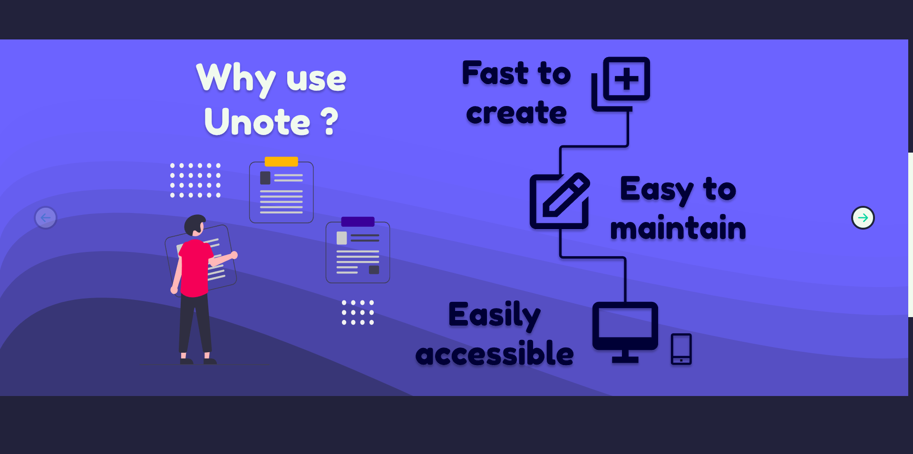

# Welcome to Unote ! -> [Click here to go to the website](https://unote.netlify.app/#/userarea)
With Unote you can access your notes from anywhere by creating an online account.

I created Unote entirely by myself, all the way from it's design using Figma to the implementation of the MERN stack, which is composed by MongoDB, Express, React and NodeJS.

## Home Page

## Dark theme Home Page

## Unote Info

## Login and Registration

## User Area

